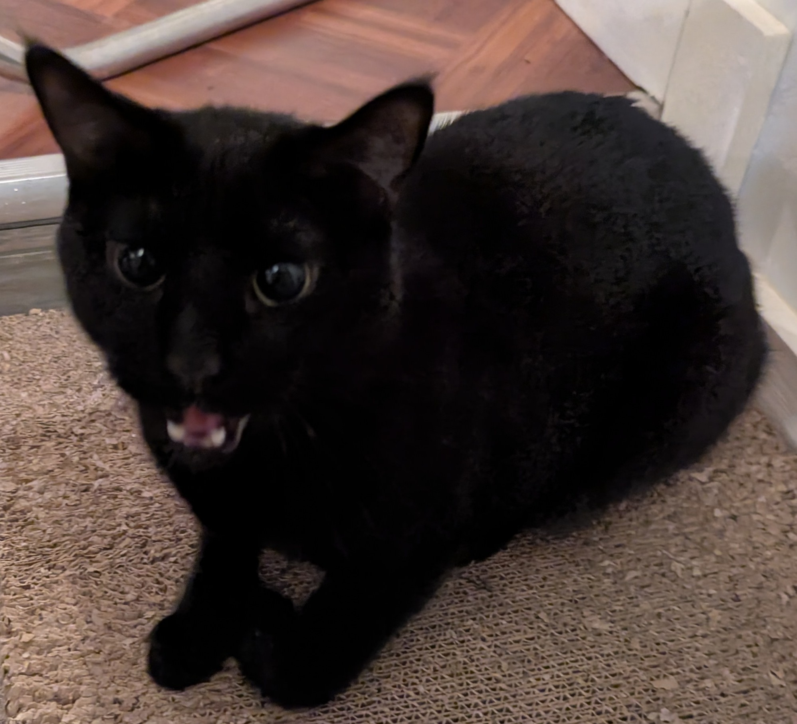

<iframe src="https://www.youtube.com/embed/2U9LDkjIGB8" allowfullscreen></iframe> 

### R.A.C.H.E.L. consisted of two computers:
* A micro-controller that served as ears for the table. Whenever a ball bounced on the table, the microphone array could tell you when a ball bounced and on what side of the table it bounced on.
* A laptop to serve two functions: referee, and the eyes. The laptop would communicate with the microcontroller to know when the ball made contact with the table, and decide where exactly the ball bounced.

### R.A.C.H.E.L. had a few extra tidbits:

* A projector to display to the players what squares had been hit, and the score.
* A keypad for the user to pick game modes and adjust the score manually.
* A microphone array attached to the bottom of the table to be the ears.
* A RGB camera, to track the ball.

### Here’s a bit more for the nerdy folks:
I worked primarily on game logic and ball tracking. Boy is it annoying to track a fast moving ping pong ball. Because we used color filtering to determine where the ball was, we had to use a specifically colored ball and fine tune the filter to match that color. Additionally, the filter had to be tweaked to fit the specific environment R.A.C.H.E.L. was set up in. For all the fancy shmancy image processing and for the dead simple UI, we used OpenCVs C++ library.

*Real Image, Color Filter and Contour Detection to Track the Ball*

Game logic consisted of using all the data we were receiving to make a judgment of what was happening on the table. But wait! Where is the table? The laptop had to know where the table was to decide where the ball hit. This meant, that the we had to calibrate the tables location manually, this was done through a little UI. After this we could translate the ball's absolute camera coordinates to its table coordinates. Another problem we had to tackle was sampling rate. The micro-controller sent out bounce data on a certain interval, and the camera was sampling ball position at another. This meant that there were a couple ball coordinates that told us where the ball “could” have bounced, so we averaged them to get a rough estimate.

**The game logic was the following: if the ball bounces twice on one side BOOM, point scored. If the ball bounced once on one side and then there were no bounces for a certain amount of time (this was a tweakable parameter) BOOM, point scored. If the ball bounced in a square, that hadn’t been hit the square would be removed. If the ball bounced in a square that had already been hit BOOM, point scored.**

Communication between the microcontroller and the laptop was through UART and the message we sent was a byte in length, telling if there was a button press on the keypad, a bounce, what side it was on, and a few error codes.

**The microcontroller was a STM32 and all the programming was done in C (shoutout to my boy Micah). The code compared signal strengths from the four microphones to decide which side the ball bounced on. The PCB (shoutout to my boy Bartosz) had interfaces for the button matrix for multiplexing and screw heads for the microphones to be attached. Each microphone had its own analog filter to clean up the signals and remove some noise. The environment we used on the laptop was linux (of course) and we needed a bit of code to properly get frames from the RGB camera. This was set up by my boy James.**

If you read this far you are definitely a nerd, so here's a little surprise for you.

*Meow*