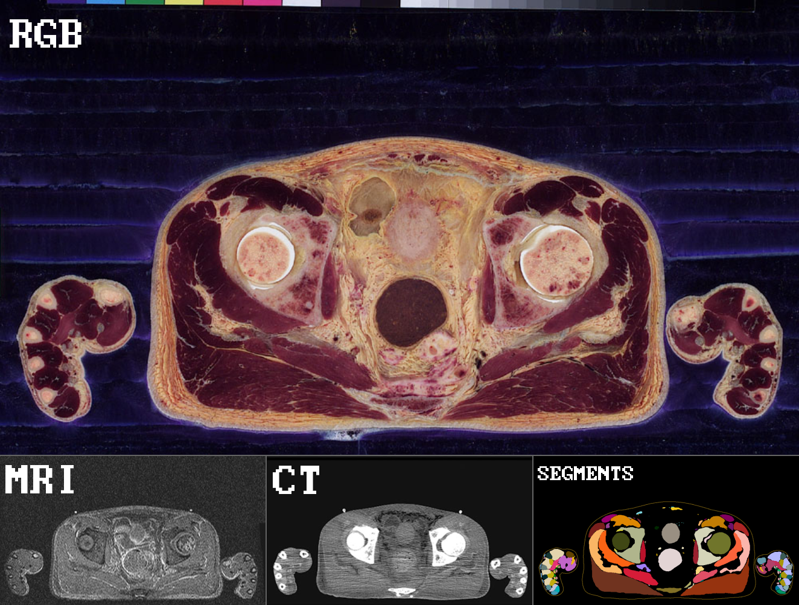
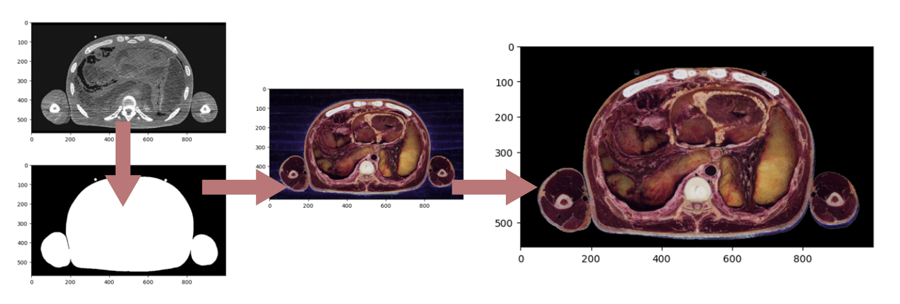
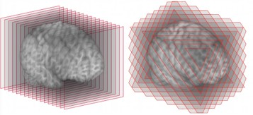
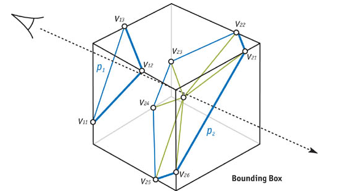
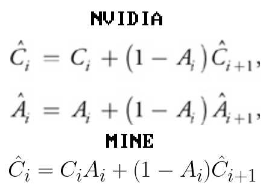
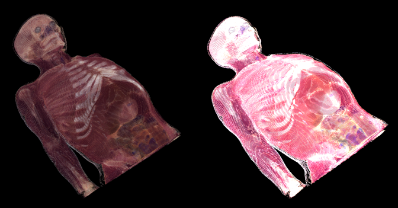

<iframe src="https://www.youtube.com/embed/JbdX9wunfFM" allowfullscreen></iframe> 

For a final project in a computer graphics programming course, I wanted to display data from the “Korean Visible Human” data set. This is a large set of images following a trend set by the first visible human data set in 1994. The sets consist of not just scan images (CT, MRI) but also full RGB color data of axial slices of the human body. From what I know, these images are collected by freezing the cadaver in a chunk of “goop.” Then a milling machine cuts the cadaver down millimeter by millimeter, capturing an image after each pass. Poor guy. What we are left with, however, is a fantastic depiction of the human body. And what makes the Korean version so awesome is it comes with a segmented slice as well, allowing for identification of every structure in the body. Below is a screen grab with each of the cross sections labeled:

****
*Visible Human Cross Section*

### Full transparency, I did not get permission to use this data set, and I am not using the full data set, just what they made publicly available.

The next natural step with this data is to set up “volumetric rendering” this term describes the rendering techniques used to display data arranged in slices, which is mostly biological scan data. Originally, I wanted to try applying “gaussian splatting” however due to time constraints I opted for a more traditional approach “texture based volumetric rendering.”
But before we can go anywhere, we gotta clean some data. The “goop” I mentioned earlier, while necessary for data collection, is not desired in the final visual result. The CT scan thankfully provided us with a hard boundary to filter the RGB image and get rid of most of that blue goop. Below is a depiction of how a slice is filtered:

Now that we have our data filtered, we can start loading it into our program. Each of the three sets (RGB, CT, Segments) used for this demo are stored in the GPU as a 3D texture. This is essentially a 3-axis lookup table, where the input values are between 0 and 1. We can use this later to easily and quickly sample data in our fragment shader.

**[Nvidia](https://developer.nvidia.com/gpugems/gpugems/part-vi-beyond-triangles/chapter-39-volume-rendering-techniques) did a great write up on the technique I used, so I won’t go too in depth. The main idea is that we are not going to display a 3D object per se, but instead a bunch of 2D images overlayed on top of each other. Below is a good picture of what these primitives look like and how they would intersect with the bounding box. These 2D shapes are always parallel to the camera, to limit the artifacts.**

*Slices*

*2D Primitive Construction*

Nvidia does not go into detail on how to calculate the primitives needed for this technique, so I drew up a simple algorithm to create them:

* Get the set of Z values (samples) that intersect with the bounding box
* Get the Z value ranges for each edge of the bounding box (12 in total)
* Get the edges that include the sample
* Linearly interpolate the X and Y for each valid edge
* Sort vertices for each sample clockwise about the center
* Average the points of each sample to find the center point
* Render each sample as a triangle fan

This provides us with a collection of 2D shapes that are parallel with the camera and equally spaced along the bounding box. Below shows what those 2D shapes look like in motion (left), and what it looks like when you mess up the algorithm (right).

Now that we have these 2D shapes we can easily paint an image on each by sampling those 3D textures we mentioned earlier. But we need to blend our layers together Nvidia supplies the equations for this, however by messing around I found that results looked better when I changed the color blending equation.

*Blending Equations*

*My Blending (Left) Nvidia Blending (Right)*

The result, as seen at the top, is a program that allows you to view CT and RGB scan data of the body and highlight specific body parts.

# References:
* [Nvidia Volumetric Rendering](https://developer.nvidia.com/gpugems/gpugems/part-vi-beyond-triangles/chapter-39-volume-rendering-techniques)